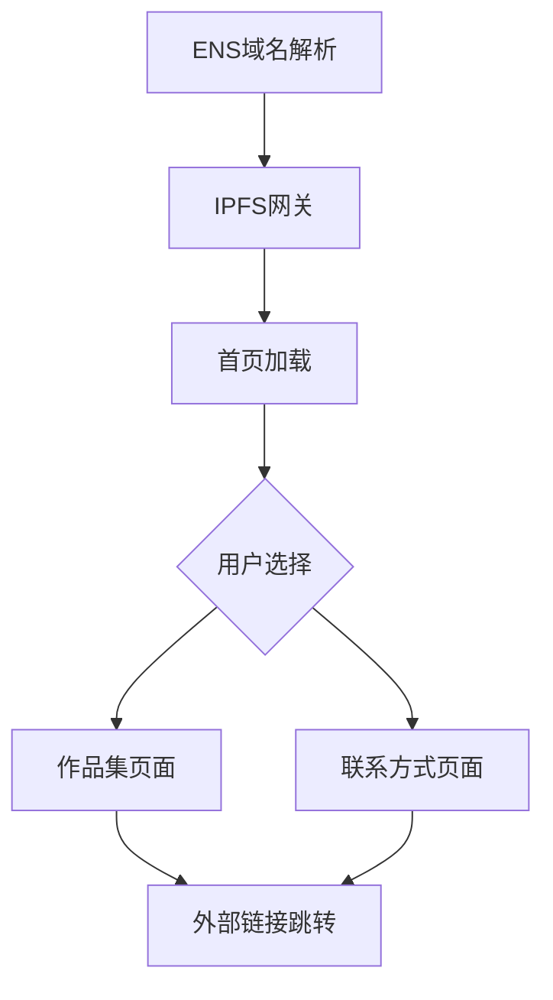

## 1. 产品概述

这是一个基于Next.js开发的个人主页网站，采用类似link3.to的视觉风格，提供纯静态的个人展示页面。网站将部署到IPFS，并通过ENS域名jiangban.eth.limo进行访问，实现去中心化的个人品牌展示。

目标用户为需要建立个人品牌和在线身份的个人用户，通过简洁优雅的方式展示个人信息、作品和联系方式。

## 2. 核心功能

### 2.1 用户角色

| 角色 | 注册方式 | 核心权限 |
|------|----------|----------|
| 访客用户 | 无需注册 | 浏览所有公开内容 |

### 2.2 功能模块

网站包含以下主要页面：
1. **首页**：个人信息展示、头像、简介、社交媒体链接
2. **作品集页面**：项目展示、技能标签、作品详情
3. **联系方式页面**：邮箱、社交媒体、其他联系方式

### 2.3 页面详情

| 页面名称 | 模块名称 | 功能描述 |
|----------|----------|----------|
| 首页 | 个人资料区 | 显示头像、姓名、职位头衔、个人简介 |
| 首页 | 社交媒体链接 | 展示Twitter、GitHub、LinkedIn等社交平台图标链接 |
| 首页 | 导航菜单 | 提供作品集、联系方式等页面跳转 |
| 作品集页面 | 项目卡片列表 | 网格布局展示项目缩略图、标题、简短描述 |
| 作品集页面 | 技能标签云 | 展示技术栈和技能标签 |
| 联系方式页面 | 联系信息列表 | 展示邮箱地址、社交账号等联系方式 |
| 联系方式页面 | 二维码展示 | 提供微信等二维码扫描添加 |

## 3. 核心流程

用户访问流程：
1. 用户通过jiangban.eth.limo域名访问网站
2. 浏览器加载IPFS上的静态页面
3. 用户浏览首页个人信息
4. 用户点击导航查看作品集或联系方式
5. 用户通过提供的链接跳转到外部社交平台

## 4. 用户界面设计

### 4.1 设计风格
- **主色调**：品牌橙色（#EA7411），搭配黑、白、灰（不使用其他彩色）
- **按钮样式**：圆角矩形，悬停时使用品牌橙色加深或改变透明度
- **字体**：主要使用Inter字体，标题使用较大字号（32px-48px）
- **布局风格**：卡片式布局，居中对称设计，极简风格（类似 link3.to）
- **图标风格**：使用 react-icons 图标库

### 4.2 页面设计概览

| 页面名称 | 模块名称 | UI元素 |
|----------|----------|--------|
| 首页 | 个人资料区 | 圆形头像200x200px，姓名字体48px粗体，职位20px常规，简介16px灰色 |
| 首页 | 社交媒体链接 | 图标大小32px，水平排列，悬停时颜色变化和轻微放大 |
| 作品集页面 | 项目卡片 | 卡片宽高比16:9，圆角12px，悬停阴影加深，标题18px粗体 |
| 联系方式页面 | 联系信息 | 列表项间距24px，图标24px，文字16px，点击可复制 |

### 4.3 响应式设计
- **桌面优先**：默认设计为桌面端，最大宽度1200px
- **移动端适配**：768px以下切换为单列布局
- **触摸优化**：按钮和链接区域最小44px点击区域