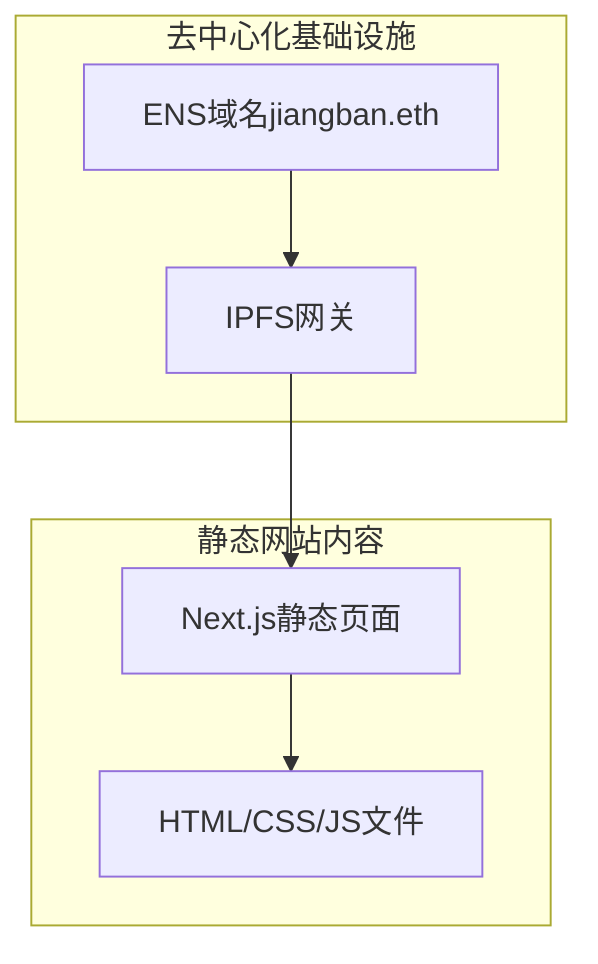

## 1. 架构设计



## 2. 技术描述

* **前端框架**：Next.js 最新版 (App Router) + React 最新版

* **初始化工具**：create-next-app

* **样式方案**：Tailwind CSS + PostCSS

* **图标库**：react-icons

* **部署方案**：静态导出 (Static Export, `out` 文件夹) + Pinata (IPFS)

* **域名解析**：ENS(.eth) + eth.limo网关

* **后端服务**：无（纯静态网站）

## 3. 路由定义

| 路由         | 目的         |
| ---------- | ---------- |
| /          | 首页，个人资料展示  |
| /portfolio | 作品集页面，展示项目 |
| /contact   | 联系方式页面     |

## 4. 构建配置

### 4.1 Next.js静态导出配置

```javascript
// next.config.js
module.exports = {
  output: 'export',
  basePath: '',
  assetPrefix: './',
  images: {
    unoptimized: true
  }
}
```

### 4.2 IPFS部署优化

* 使用相对路径确保资源正确加载

* 禁用Next.js Image优化（静态导出限制）

* 所有资源文件使用本地引用

* 生成完整的静态HTML文件

### 4.3 ENS域名配置

* ENS记录类型：Content Hash

* 内容哈希：IPFS CID (Qm...格式)

* 解析网关：eth.limo

* 备用网关：eth.link

## 5. 开发环境搭建

### 5.1 项目初始化

```bash
npx create-next-app@latest jiangban-website --typescript --tailwind --app
```

### 5.2 必要依赖

```bash
npm install lucide-react
```

### 5.3 开发命令

```bash
npm run dev      # 开发服务器
npm run build    # 构建静态文件
npm run export   # 导出到out目录
```

## 6. IPFS部署流程 (Pinata)

1. 配置 Next.js：在 `next.config.mjs` 中设置 `output: 'export'`，并确保 `images.unoptimized = true`。
2. 构建静态文件：运行构建命令 `pnpm build`，Next.js 会在根目录生成 `out` 文件夹。
3. 上传到 Pinata：登录 Pinata 后台，选择 Upload -> Folder，将整个 `out` 文件夹上传。
4. 获取 CID：上传成功后，Pinata 会为该文件夹生成一个唯一的 IPFS CID (Qm... 格式)。
5. 配置 ENS：在 ENS 管理器 (app.ens.domains) 中，设置 `jiangban.eth` 的 Content Hash 为该 CID (`ipfs://<CID>`)。
6. 验证访问：通过 `https://jiangban.eth.limo` 访问网站。

## 7. 性能优化

* 启用静态生成(SSG)预渲染所有页面

* 使用Tailwind CSS减少样式文件大小

* 压缩图片资源，使用WebP格式

* 启用浏览器缓存，设置长期缓存策略

* 使用CDN加速（IPFS网关自带分布式特性）

